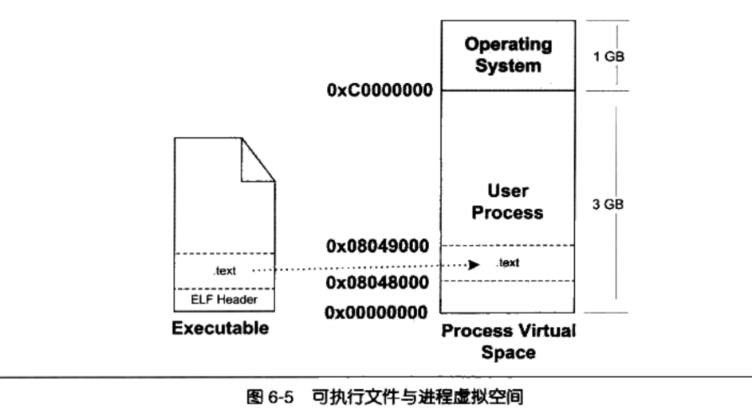
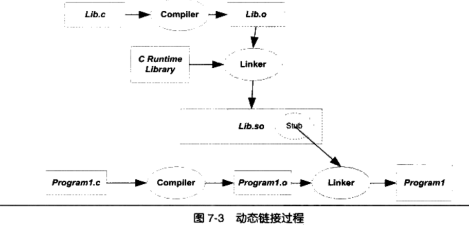

## Table of contents

## 概述

在我们进行GCC编译用户程序时，分为四个步骤：预处理（Prepressing)、编译（Compilation)、汇编(Assembly)、链接(Linking)

### 预编译

gcc 加上-E参数只进行预编译，或者使用cpp命令,生成.i文件

```bash
gcc -E hello.c -o hello.i
cpp hello.c > hello.i
```

展开所有的宏定义、处理条件预编译指令、删除注释、添加调试的行号、保留#pramgma编译器指令

### 编译

词法分析、语法分析、语义分析，优化生产相应的汇编代码文件。

```bash
gcc -S hello.i -o hello.s
cc1 hello.c
```

gcc实际上是后台程序封装，根据不同参数要求去调用：cc1、as、ld

### 汇编

通过汇编器将汇编代码转换成机器指令，生成目标文件（Object File）

~~~bash
as hello.s -o hello.o
gcc -c hello.s -o hello.o
~~~

### 链接

分为动态链接和静态链接

静态链接大致如下：

链接的过程包括地址和空间分配（Address and Storage Allocation）、符号决议（Symbol Resolution）和重定位（Relocation）这几步

静态链接的过程如下：


使用链接器时，会根据所引用其他模块的函数和全局变量无需知道它们的地址，链接器在链接时会根据引用的符号自动去相应的模块查找真正的地址。

创建a.c和b.c，分别进行`gcc -c`生成`a.o`和`b.o`文件，

```c
// a.c
#include <stdio.h>

int main () {
        int a = 2, b = 3;
        int c = sum (a, b);
        printf("%d\n", c);
        return 0;
}
```

```c
// b.c
int sum (int l, int r) {
        return l + r;
}
```

```bash
gcc -c a.c -o a.o -g
gcc -c b.c -o b.o -g
objdump -dSCl a.o
gcc a.o b.o -o ab
objdump -dSCl ab
```

反编译`a.o`和`ab.o`进行对比


在单独编译时，无法知道sum函数的地址，所以将目标地址设置成0，当链接器链接时进行了**目标地址的修正**， 这个地址修正的过程叫做**重定位**（Relocation），每个要被修正的地方叫一个**重定位入口**（Relocation Entry）。

## 目标文件

目前可执行文件格式Windows下的PE（Portable Executable Linkable Format）和Linux下的ELF（Executable Linkable Format）都是COFF（Common file format）格式的变种。目标文件就是源代码编译但未进行链接的哪些中间文件（.obj或.o文件）。
动态链接库（.dll、.so）、静态链接库（.lib、.a）文件也都按照可执行文件格式存储
ELF标准中把系统中采用的ELF文件格式归为以下4类


| ELF文件类型      | 说明                                                                                                                                              | 实例                             |
| ------------------ | --------------------------------------------------------------------------------------------------------------------------------------------------- | ---------------------------------- |
| 可重定位目标文件 | 包含了代码和数据、静态链接库                                                                                                                      | Linux下.o、Windows下的.obj       |
| 可执行文件       | 可以直接执行的程序                                                                                                                                | /bin/bash下的文件、Windows的.exe |
| 共享目标文件     | 包含代码和数据，1.链接器使用这种文件跟其他可重定位文件和目标文件进行链接 2.动态连接器将这几种共享目标文件和可执行文件结合、进程映像的一部分来运行 | Linux下的.so Windows下的DLL      |
| 核心转储·文件   | 当进程意外终止时，系统可以将改进程的地址空间的内容及终止时的一些其他信息转储到核心转储文件                                                        | Linux下的 core dump              |

```bash
@sinserver:~/study# file perf_event_open.o
perf_event_open.o: ELF 64-bit LSB relocatable, x86-64, version 1 (SYSV), not stripped
root@sinserver:~/study# file perf_event_open
perf_event_open: ELF 64-bit LSB pie executable, x86-64, version 1 (SYSV), dynamically linked, interpreter /lib64/ld-linux-x86-64.so.2, BuildID[sha1]=364416fe87f07e054089c81de8852d4ee865d22e, for GNU/Linux 3.2.0, with debug_info, not stripped
```

通过`file`命令查看对应的文件格式，通过`readelf`命令查看程序头

```bash

root@sinserver:~/study# readelf -h perf_event_open.o
ELF Header:
  Magic:   7f 45 4c 46 02 01 01 00 00 00 00 00 00 00 00 00
  Class:                             ELF64
  Data:                              2's complement, little endian
  Version:                           1 (current)
  OS/ABI:                            UNIX - System V
  ABI Version:                       0
  Type:                              REL (Relocatable file)
  Machine:                           Advanced Micro Devices X86-64
  Version:                           0x1
  Entry point address:               0x0
  Start of program headers:          0 (bytes into file)
  Start of section headers:          1496 (bytes into file)
  Flags:                             0x0
  Size of this header:               64 (bytes)
  Size of program headers:           0 (bytes)
  Number of program headers:         0
  Size of section headers:           64 (bytes)
  Number of section headers:         14
  Section header string table index: 13

root@sinserver:~/study# readelf -h perf_event_open
ELF Header:
  Magic:   7f 45 4c 46 02 01 01 00 00 00 00 00 00 00 00 00
  Class:                             ELF64
  Data:                              2's complement, little endian
  Version:                           1 (current)
  OS/ABI:                            UNIX - System V
  ABI Version:                       0
  Type:                              DYN (Position-Independent Executable file)
  Machine:                           Advanced Micro Devices X86-64
  Version:                           0x1
  Entry point address:               0x1140
  Start of program headers:          64 (bytes into file)
  Start of section headers:          18808 (bytes into file)
  Flags:                             0x0
  Size of this header:               64 (bytes)
  Size of program headers:           56 (bytes)
  Number of program headers:         13
  Size of section headers:           64 (bytes)
  Number of section headers:         37
  Section header string table index: 36
```

### 目标文件的格式

ELF文件格式分为：

- ELF文件头 (ELF Header)
- 程序头表（Program header table）
- 段表/节头部表（Section Header Table）
- 重定位表（Relcation Table）
- 字符串表
- 符号表
- 各个段


### ELF文件头 (ELF Header)

包含整个文件的基本属性，文件头中定义了ELF魔数、文件机器字节长度、数据存储方式、版本、运行平台、ABI版本、ELF重定位类型、硬件平台、硬件平台版本、入口地址、程序头入口和长度、段表的位置及段的数量。

```bash
root@sinserver:~/study# readelf -h perf_event_open
ELF Header:
  Magic:   7f 45 4c 46 02 01 01 00 00 00 00 00 00 00 00 00
  Class:                             ELF64
  Data:                              2's complement, little endian
  Version:                           1 (current)
  OS/ABI:                            UNIX - System V
  ABI Version:                       0
  Type:                              DYN (Position-Independent Executable file)
  Machine:                           Advanced Micro Devices X86-64
  Version:                           0x1
  Entry point address:               0x1140
  Start of program headers:          64 (bytes into file)
  Start of section headers:          18808 (bytes into file)
  Flags:                             0x0
  Size of this header:               64 (bytes)
  Size of program headers:           56 (bytes)
  Number of program headers:         13
  Size of section headers:           64 (bytes)
  Number of section headers:         37
  Section header string table index: 36
```

ELF魔数：最前面的 Magic 的十六个字节表示

- 第0个字节对应ASCII字符里面的DEL控制符，第1~3个字节刚好是ELF三个字母的ASCII值，几乎所有的可执行文件开始的几个字节都是这个魔数，这种魔数用于确认文件的类型
- 第4个字节标识文件的位数，0x01表示32位，0x02表示64位
- 第5个字节表示文件的字典序，0x01表示小端序、0x02表示大端序
- 第6个字节表示ELF文件的主版本号，一般是1
- 后面的9个字节ELF标准没有定义，作为扩展使用

### 节头部表（Section Header Table）

描述了ELF各个段的信息，比如每个段的段名、段的长度、在文件中的偏移、读写权限及段的其他属性。ELF的段结构就是由段表决定的。

```bash
root@sinserver:~/study# readelf -W -S perf_event_open
There are 37 section headers, starting at offset 0x4978:

Section Headers:
  [Nr] Name              Type            Address          Off    Size   ES Flg Lk Inf Al
  [ 0]                   NULL            0000000000000000 000000 000000 00      0   0  0
  [ 1] .interp           PROGBITS        0000000000000318 000318 00001c 00   A  0   0  1
  [ 2] .note.gnu.property NOTE            0000000000000338 000338 000030 00   A  0   0  8
  [ 3] .note.gnu.build-id NOTE            0000000000000368 000368 000024 00   A  0   0  4
  [ 4] .note.ABI-tag     NOTE            000000000000038c 00038c 000020 00   A  0   0  4
  [ 5] .gnu.hash         GNU_HASH        00000000000003b0 0003b0 000024 00   A  6   0  8
  [ 6] .dynsym           DYNSYM          00000000000003d8 0003d8 000150 18   A  7   1  8
  [ 7] .dynstr           STRTAB          0000000000000528 000528 0000d1 00   A  0   0  1
  [ 8] .gnu.version      VERSYM          00000000000005fa 0005fa 00001c 02   A  6   0  2
  [ 9] .gnu.version_r    VERNEED         0000000000000618 000618 000040 00   A  7   1  8
  [10] .rela.dyn         RELA            0000000000000658 000658 0000c0 18   A  6   0  8
  [11] .rela.plt         RELA            0000000000000718 000718 0000c0 18  AI  6  24  8
  [12] .init             PROGBITS        0000000000001000 001000 00001b 00  AX  0   0  4
  [13] .plt              PROGBITS        0000000000001020 001020 000090 10  AX  0   0 16
  [14] .plt.got          PROGBITS        00000000000010b0 0010b0 000010 10  AX  0   0 16
  [15] .plt.sec          PROGBITS        00000000000010c0 0010c0 000080 10  AX  0   0 16
  [16] .text             PROGBITS        0000000000001140 001140 000253 00  AX  0   0 16
  [17] .fini             PROGBITS        0000000000001394 001394 00000d 00  AX  0   0  4
  [18] .rodata           PROGBITS        0000000000002000 002000 00002b 00   A  0   0  4
  [19] .eh_frame_hdr     PROGBITS        000000000000202c 00202c 00003c 00   A  0   0  4
  [20] .eh_frame         PROGBITS        0000000000002068 002068 0000cc 00   A  0   0  8
  [21] .init_array       INIT_ARRAY      0000000000003d80 002d80 000008 08  WA  0   0  8
  [22] .fini_array       FINI_ARRAY      0000000000003d88 002d88 000008 08  WA  0   0  8
  [23] .dynamic          DYNAMIC         0000000000003d90 002d90 0001f0 10  WA  7   0  8
  [24] .got              PROGBITS        0000000000003f80 002f80 000080 08  WA  0   0  8
  [25] .data             PROGBITS        0000000000004000 003000 000010 00  WA  0   0  8
  [26] .bss              NOBITS          0000000000004010 003010 000008 00  WA  0   0  1
  [27] .comment          PROGBITS        0000000000000000 003010 000026 01  MS  0   0  1
  [28] .debug_aranges    PROGBITS        0000000000000000 003036 000030 00      0   0  1
  [29] .debug_info       PROGBITS        0000000000000000 003066 00071c 00      0   0  1
  [30] .debug_abbrev     PROGBITS        0000000000000000 003782 0001d5 00      0   0  1
  [31] .debug_line       PROGBITS        0000000000000000 003957 0000c7 00      0   0  1
  [32] .debug_str        PROGBITS        0000000000000000 003a1e 000651 01  MS  0   0  1
  [33] .debug_line_str   PROGBITS        0000000000000000 00406f 0000f5 01  MS  0   0  1
  [34] .symtab           SYMTAB          0000000000000000 004168 000420 18     35  18  8
  [35] .strtab           STRTAB          0000000000000000 004588 000281 00      0   0  1
  [36] .shstrtab         STRTAB          0000000000000000 004809 00016a 00      0   0  1

```

readelf -S 输出的结果就是段表的内容


### 程序头表（Program header table）

描述ELF的 "Segment"

通过`readelf -l`命令查看可执行文件中的段

```bash
root@sinserver:~/study# readelf -l SectionMapping.elf -W

Elf file type is EXEC (Executable file)
Entry point 0x401720
There are 10 program headers, starting at offset 64

Program Headers:
  Type           Offset   VirtAddr           PhysAddr           FileSiz  MemSiz   Flg Align
  LOAD           0x000000 0x0000000000400000 0x0000000000400000 0x0004f8 0x0004f8 R   0x1000
  LOAD           0x001000 0x0000000000401000 0x0000000000401000 0x07d6b1 0x07d6b1 R E 0x1000
  LOAD           0x07f000 0x000000000047f000 0x000000000047f000 0x0259ec 0x0259ec R   0x1000
  LOAD           0x0a4f50 0x00000000004a5f50 0x00000000004a5f50 0x005b78 0x00b2f8 RW  0x1000
  NOTE           0x000270 0x0000000000400270 0x0000000000400270 0x000030 0x000030 R   0x8
  NOTE           0x0002a0 0x00000000004002a0 0x00000000004002a0 0x000044 0x000044 R   0x4
  TLS            0x0a4f50 0x00000000004a5f50 0x00000000004a5f50 0x000018 0x000058 R   0x8
  GNU_PROPERTY   0x000270 0x0000000000400270 0x0000000000400270 0x000030 0x000030 R   0x8
  GNU_STACK      0x000000 0x0000000000000000 0x0000000000000000 0x000000 0x000000 RW  0x10

```

`LOAD`类型的segment需要被映射

根据Flg不同的标志位映射到不同的`VMA`

只有可执行文件和共享库文件才需要有程序头表，目标文件是没有的


### 重定位表

链接器在处理目标文件时，需要对目标文件一些部位进行重定位，修正地址引用的位置，对于每个需要重定位的代码段或数据段，都需要一个相应的重定位表。比如`.rel.txt`就是`.text`的重定位表

通过 `objdump -r` 命令可以

```bash
root@sinserver:~/study# objdump -r a.o

a.o:     file format elf64-x86-64

RELOCATION RECORDS FOR [.text]:
OFFSET           TYPE              VALUE
0000000000000029 R_X86_64_PC32     shared-0x0000000000000004
0000000000000039 R_X86_64_PLT32    swap-0x0000000000000004
0000000000000052 R_X86_64_PLT32    __stack_chk_fail-0x0000000000000004

```

### BSS段

未初始化的全局变量和局部静态变量，只是预留一个**未定义的全局变量符号**，等最终链接为可执行文件时再分配空间

### 代码段

### .data段

保存已经初始化的全局静态变量和局部静态变量，前4个字节涉及CPU字节序

### .rodata

存放只读数据

### ELF符号表

在ELF文件中有一段叫 .symtab的符号表，包含了以下信息


使用`readelf -s `命令输出格式与上面一一对应

```bash
root@sinserver:~/study# readelf -s perf_event_open.o

Symbol table '.symtab' contains 14 entries:
   Num:    Value          Size Type    Bind   Vis      Ndx Name
     0: 0000000000000000     0 NOTYPE  LOCAL  DEFAULT  UND
     1: 0000000000000000     0 FILE    LOCAL  DEFAULT  ABS perf_event_open.c
     2: 0000000000000000     0 SECTION LOCAL  DEFAULT    1 .text
     3: 0000000000000000     0 SECTION LOCAL  DEFAULT    5 .rodata
     4: 0000000000000000    72 FUNC    GLOBAL DEFAULT    1 perf_event_open
     5: 0000000000000000     0 NOTYPE  GLOBAL DEFAULT  UND syscall
     6: 0000000000000048   290 FUNC    GLOBAL DEFAULT    1 main
     7: 0000000000000000     0 NOTYPE  GLOBAL DEFAULT  UND memset
     8: 0000000000000000     0 NOTYPE  GLOBAL DEFAULT  UND perror
     9: 0000000000000000     0 NOTYPE  GLOBAL DEFAULT  UND ioctl
    10: 0000000000000000     0 NOTYPE  GLOBAL DEFAULT  UND read
    11: 0000000000000000     0 NOTYPE  GLOBAL DEFAULT  UND printf
    12: 0000000000000000     0 NOTYPE  GLOBAL DEFAULT  UND sleep
    13: 0000000000000000     0 NOTYPE  GLOBAL DEFAULT  UND __stack_chk_fail

root@sinserver:~/study# readelf -s perf_event_open

Symbol table '.dynsym' contains 14 entries:
   Num:    Value          Size Type    Bind   Vis      Ndx Name
     0: 0000000000000000     0 NOTYPE  LOCAL  DEFAULT  UND
     1: 0000000000000000     0 FUNC    GLOBAL DEFAULT  UND _[...]@GLIBC_2.34 (2)
     2: 0000000000000000     0 NOTYPE  WEAK   DEFAULT  UND _ITM_deregisterT[...]
     3: 0000000000000000     0 FUNC    GLOBAL DEFAULT  UND __[...]@GLIBC_2.4 (3)
     4: 0000000000000000     0 FUNC    GLOBAL DEFAULT  UND [...]@GLIBC_2.2.5 (4)
     5: 0000000000000000     0 FUNC    GLOBAL DEFAULT  UND [...]@GLIBC_2.2.5 (4)
     6: 0000000000000000     0 FUNC    GLOBAL DEFAULT  UND ioctl@GLIBC_2.2.5 (4)
     7: 0000000000000000     0 FUNC    GLOBAL DEFAULT  UND read@GLIBC_2.2.5 (4)
     8: 0000000000000000     0 FUNC    GLOBAL DEFAULT  UND [...]@GLIBC_2.2.5 (4)
     9: 0000000000000000     0 NOTYPE  WEAK   DEFAULT  UND __gmon_start__
    10: 0000000000000000     0 FUNC    GLOBAL DEFAULT  UND [...]@GLIBC_2.2.5 (4)
    11: 0000000000000000     0 NOTYPE  WEAK   DEFAULT  UND _ITM_registerTMC[...]
    12: 0000000000000000     0 FUNC    GLOBAL DEFAULT  UND sleep@GLIBC_2.2.5 (4)
    13: 0000000000000000     0 FUNC    WEAK   DEFAULT  UND [...]@GLIBC_2.2.5 (4)

Symbol table '.symtab' contains 44 entries:
   Num:    Value          Size Type    Bind   Vis      Ndx Name
     0: 0000000000000000     0 NOTYPE  LOCAL  DEFAULT  UND
     1: 0000000000000000     0 FILE    LOCAL  DEFAULT  ABS Scrt1.o
     2: 000000000000038c    32 OBJECT  LOCAL  DEFAULT    4 __abi_tag
     3: 0000000000000000     0 FILE    LOCAL  DEFAULT  ABS crtstuff.c
     4: 0000000000001170     0 FUNC    LOCAL  DEFAULT   16 deregister_tm_clones
     5: 00000000000011a0     0 FUNC    LOCAL  DEFAULT   16 register_tm_clones
     6: 00000000000011e0     0 FUNC    LOCAL  DEFAULT   16 __do_global_dtors_aux
     7: 0000000000004010     1 OBJECT  LOCAL  DEFAULT   26 completed.0
     8: 0000000000003d88     0 OBJECT  LOCAL  DEFAULT   22 __do_global_dtor[...]
     9: 0000000000001220     0 FUNC    LOCAL  DEFAULT   16 frame_dummy
    10: 0000000000003d80     0 OBJECT  LOCAL  DEFAULT   21 __frame_dummy_in[...]
    11: 0000000000000000     0 FILE    LOCAL  DEFAULT  ABS perf_event_open.c
    12: 0000000000000000     0 FILE    LOCAL  DEFAULT  ABS crtstuff.c
    13: 0000000000002130     0 OBJECT  LOCAL  DEFAULT   20 __FRAME_END__
    14: 0000000000000000     0 FILE    LOCAL  DEFAULT  ABS
    15: 0000000000003d90     0 OBJECT  LOCAL  DEFAULT   23 _DYNAMIC
    16: 000000000000202c     0 NOTYPE  LOCAL  DEFAULT   19 __GNU_EH_FRAME_HDR
    17: 0000000000003f80     0 OBJECT  LOCAL  DEFAULT   24 _GLOBAL_OFFSET_TABLE_
    18: 0000000000000000     0 FUNC    GLOBAL DEFAULT  UND __libc_start_mai[...]
    19: 0000000000000000     0 NOTYPE  WEAK   DEFAULT  UND _ITM_deregisterT[...]
    20: 0000000000004000     0 NOTYPE  WEAK   DEFAULT   25 data_start
    21: 0000000000004010     0 NOTYPE  GLOBAL DEFAULT   25 _edata
    22: 0000000000001394     0 FUNC    GLOBAL HIDDEN    17 _fini
    23: 0000000000000000     0 FUNC    GLOBAL DEFAULT  UND __stack_chk_fail[...]
    24: 0000000000000000     0 FUNC    GLOBAL DEFAULT  UND printf@GLIBC_2.2.5
    25: 0000000000000000     0 FUNC    GLOBAL DEFAULT  UND memset@GLIBC_2.2.5
    26: 0000000000000000     0 FUNC    GLOBAL DEFAULT  UND ioctl@GLIBC_2.2.5
    27: 0000000000000000     0 FUNC    GLOBAL DEFAULT  UND read@GLIBC_2.2.5
    28: 0000000000004000     0 NOTYPE  GLOBAL DEFAULT   25 __data_start
    29: 0000000000000000     0 FUNC    GLOBAL DEFAULT  UND syscall@GLIBC_2.2.5
    30: 0000000000000000     0 NOTYPE  WEAK   DEFAULT  UND __gmon_start__
    31: 0000000000004008     0 OBJECT  GLOBAL HIDDEN    25 __dso_handle
    32: 0000000000002000     4 OBJECT  GLOBAL DEFAULT   18 _IO_stdin_used
    33: 0000000000004018     0 NOTYPE  GLOBAL DEFAULT   26 _end
    34: 0000000000001140    38 FUNC    GLOBAL DEFAULT   16 _start
    35: 0000000000004010     0 NOTYPE  GLOBAL DEFAULT   26 __bss_start
    36: 0000000000001271   290 FUNC    GLOBAL DEFAULT   16 main
    37: 0000000000000000     0 FUNC    GLOBAL DEFAULT  UND perror@GLIBC_2.2.5
    38: 0000000000004010     0 OBJECT  GLOBAL HIDDEN    25 __TMC_END__
    39: 0000000000000000     0 NOTYPE  WEAK   DEFAULT  UND _ITM_registerTMC[...]
    40: 0000000000000000     0 FUNC    GLOBAL DEFAULT  UND sleep@GLIBC_2.2.5
    41: 0000000000000000     0 FUNC    WEAK   DEFAULT  UND __cxa_finalize@G[...]
    42: 0000000000001000     0 FUNC    GLOBAL HIDDEN    12 _init
    43: 0000000000001229    72 FUNC    GLOBAL DEFAULT   16 perf_event_open


```

### 强符号和弱符号

C/C++来说，编译器默认函数和初始化的全局变量为强符号，未初始化的全局变量为弱符号

规则如下：


强引用和弱引用

- 强引用：最终链接为可执行文件时，如果没有符号的定义，链接器会报符号未定义错误，这种被称为强引用（Strong Reference)
- 弱引用：处理弱引用时，如果该符号有定义，则链接器将该符号的引用决议；如果该符号未被定义，则链接器对于该引用不报错

## 静态链接

链接的过程分为两步：

1. 空间与地址分配： 扫描所有的输入目标文件，并且获取它们的各个段的长度、属性和位置，并且将输入符号表中所有的符号定义和符号引用都收集起来，统一放到一个全局符号表。链接器将各个段合并，建立映射关系
2. 符号解析和重定位：读入文件中段的数据、重定位信息，进行符号解析与重定位、调整代码中的地址。

### 空间和地址分配

当链接后，使用`objdump -h`命令可以查看到对应段的VMA和LMA都已经分配好了地址。

之后开始计算各个符号的虚拟地址，需要给每个符号添加一个偏移量，调整到正确的虚拟地址。

### 符号解析和重定位

由于编译的时候，并不知道定义在其他目标文件中的符号的地址，所以先用一个临时的假地址，就可以根据符号对需要重定位的地址进行绝对修正或相对修正到正确的位置。

### 静态库链接

静态库实际上是一组目标文件的集合

可以通过ar压缩程序将目标文件压缩到一起，比如`libc.a`这个静态库文件

```bash
ar -t /usr/lib/x86_64-linux-gnu/libc.a # 列出归档文件包含的目标文件
```

### 链接器的控制

编写一个不依赖库函数的 "最小程序"

```cpp
char* str = "Hello World!\n";

void print () {
        asm ( "movl $13, %%edx \n\t"
             "movl %0, %%ecx \n\t"
             "movl $0, %%ebx \n\t"
             "movl $4, %%eax \n\t"
             "int $0x80 \n\t"
             ::"r"(str):"edx","ecx","ebx");
}
void exit() {
        asm ("movl $42, %ebx \n\t"
             "movl $1, %eax \n\t"
             "int $0x80 \n\t" );
}
void nomain () {
        print();
        exit();
}
```

```bash
gcc -c -fno-builtin -nostdlib -static -m32 -fno-asynchronous-unwind-tables -fno-pic -fno-pie TinyHelloWorld.c -o TinyHelloWorld.o

ld -static -e nomain -o TinyHelloWorld TinyHelloWorld.o -m elf_i386

```

默认情况下，编译器可能会生成位置无关代码，这会导致创建 `.got.plt` 段, 所以加上`-fno-pic -fno-pie` 参数去除

使用 `-fno-asynchronous-unwind-tables` 禁用栈展开表`.eh_frame`的生成

观察到这样生成的可执行文件的段如下：

```bash
root@sinserver:~/study# readelf -S TinyHelloWorld
There are 8 section headers, starting at offset 0x2144:

Section Headers:
  [Nr] Name              Type            Addr     Off    Size   ES Flg Lk Inf Al
  [ 0]                   NULL            00000000 000000 000000 00      0   0  0
  [ 1] .text             PROGBITS        08049000 001000 000044 00  AX  0   0  1
  [ 2] .rodata           PROGBITS        0804a000 002000 00000e 00   A  0   0  1
  [ 3] .data             PROGBITS        0804b010 002010 000004 00  WA  0   0  4
  [ 4] .comment          PROGBITS        00000000 002014 000026 01  MS  0   0  1
  [ 5] .symtab           SYMTAB          00000000 00203c 000090 10      6   2  4
  [ 6] .strtab           STRTAB          00000000 0020cc 000040 00      0   0  1
  [ 7] .shstrtab         STRTAB          00000000 00210c 000038 00      0   0  1

```

.text存放的是程序的指令

.rodata存放的是字符串"Hello World!"

.data存放的是str全局变量

.comment存放的是编译器和系统版本信息

编写链接脚本`TinyHelloWorld.lds`，将上面四个公用的段合并成一个

```bash
ENTRY(nomain)

SECTIONS
{
        . = 0x08048000 + SIZEOF_HEADERS;
        tinytext : { *{.text} *{.data} *{.rodata} }
        /DISCARD/ : { {*.comment} }
}

```

```bash
gcc -c -fno-builtin -nostdlib -static -m32 -fno-asynchronous-unwind-tables -fno-pic -fno-pie TinyHelloWorld.c -o TinyHelloWorld.o

ld -static -T TinyHelloWorld.lds -o TinyHelloWorld TinyHelloWorld.o -m elf_i386

```

```bash
root@sinserver:~/study# readelf -S TinyHelloWorld
There are 5 section headers, starting at offset 0x198:

Section Headers:
  [Nr] Name              Type            Addr     Off    Size   ES Flg Lk Inf Al
  [ 0]                   NULL            00000000 000000 000000 00      0   0  0
  [ 1] tinytext          PROGBITS        08048094 000094 000056 00 WAX  0   0  4
  [ 2] .symtab           SYMTAB          00000000 0000ec 000060 10      3   2  4
  [ 3] .strtab           STRTAB          00000000 00014c 000028 00      0   0  1
  [ 4] .shstrtab         STRTAB          00000000 000174 000024 00      0   0  1

```

观察到已经合并成功，但是还有三个段

- .symtab : 符号表
- .strtab : 字符表
- .shstrtab : 段名称字符表

ld命令加上 `-s` 去除字符表和符号表，.shstrtab是保存段名是不少的

```bash
root@sinserver:~/study# readelf -S TinyHelloWorld
There are 3 section headers, starting at offset 0x100:

Section Headers:
  [Nr] Name              Type            Addr     Off    Size   ES Flg Lk Inf Al
  [ 0]                   NULL            00000000 000000 000000 00      0   0  0
  [ 1] tinytext          PROGBITS        08048094 000094 000056 00 WAX  0   0  4
  [ 2] .shstrtab         STRTAB          00000000 0000ea 000014 00      0   0  1


root@sinserver:~/study# ./TinyHelloWorld
Hello World!

```

这样就生成了一个最小的ELF可执行文件啦

## 可执行文件的装载

### 从操作系统的角度看可执行文件的装载

首先要进行进程的创建

- 创建虚拟地址空间
  - 虚拟地址空间由一组页映射函数将虚拟地址空间的各个页映射到相应的物理地址空间，创建虚拟地址空间就是创建映射函数所需要的相应的数据结构，在i386的Linux中，创建虚拟地址空间实际上是分配一个页目录，不需要建立页的映射关系，这些映射关系等到后面发生页错误的时候再进行设置，完成虚拟空间和物理内存的应黑色
- 读取可执行文件头，建立虚拟地址空间与可执行文件的映射关系。
  - 当缺页异常发生时，程序需要知道所需要的页在可执行文件中的哪个位置，这也是"装载"的重要过程




这种映射关系只是保存在操作系统内部的一个数据结构，Linux中将进程虚拟空间中的一个段叫做虚拟内存区域（VMA），OS在创建进程后，在进程相应数据结构设置相应的.text段的VMA，将CPU指令寄存器设置为可执行文件的入口，启动运行，将控制权转交给进程，跳转到可执行文件的入口地址。

### 进程虚拟地址分布

在可执行文件里，包含的各种段数量增多时，会产生空间浪费的问题，在OS进行装在时，可以不关系每个段包含的实际内容，最主要的是**权限问题（可读、可写、可执行）**。ELF文件中，段的权限往往只有为数不多的几种组合

- 可读可执行：代码段
- 可读可写：数据段、BSS段等
- 只读：其他

所以将相同权限的段，可以合并到一个段中进行映射

Segment包含一个或多个属性相似的"Section"，装载的时候可以将他们看作一个整体一起映射，对应一个VMA,可以减少页面内部碎片，节省内存空间

通过`readelf -l`查看ELF的 segment，上面的程序头表有介绍

```bash
root@sinserver:~/study# readelf -l SectionMapping.elf -W

Elf file type is EXEC (Executable file)
Entry point 0x401720
There are 10 program headers, starting at offset 64

Program Headers:
  Type           Offset   VirtAddr           PhysAddr           FileSiz  MemSiz   Flg Align
  LOAD           0x000000 0x0000000000400000 0x0000000000400000 0x0004f8 0x0004f8 R   0x1000
  LOAD           0x001000 0x0000000000401000 0x0000000000401000 0x07d6b1 0x07d6b1 R E 0x1000
  LOAD           0x07f000 0x000000000047f000 0x000000000047f000 0x0259ec 0x0259ec R   0x1000
  LOAD           0x0a4f50 0x00000000004a5f50 0x00000000004a5f50 0x005b78 0x00b2f8 RW  0x1000
  NOTE           0x000270 0x0000000000400270 0x0000000000400270 0x000030 0x000030 R   0x8
  NOTE           0x0002a0 0x00000000004002a0 0x00000000004002a0 0x000044 0x000044 R   0x4
  TLS            0x0a4f50 0x00000000004a5f50 0x00000000004a5f50 0x000018 0x000058 R   0x8
  GNU_PROPERTY   0x000270 0x0000000000400270 0x0000000000400270 0x000030 0x000030 R   0x8
  GNU_STACK      0x000000 0x0000000000000000 0x0000000000000000 0x000000 0x000000 RW  0x10
  GNU_RELRO      0x0a4f50 0x00000000004a5f50 0x00000000004a5f50 0x0040b0 0x0040b0 R   0x1

 Section to Segment mapping:
  Segment Sections...
   00     .note.gnu.property .note.gnu.build-id .note.ABI-tag .rela.plt
   01     .init .plt .text .fini
   02     .rodata .stapsdt.base rodata.cst32 .eh_frame .gcc_except_table
   03     .tdata .init_array .fini_array .data.rel.ro .got .got.plt .data .bss
   04     .note.gnu.property
   05     .note.gnu.build-id .note.ABI-tag
   06     .tdata .tbss
   07     .note.gnu.property
   08
   09     .tdata .init_array .fini_array .data.rel.ro .got


```

在OS中，VMA除了可以映射可执行文件的各个Segment以外，还可以对进程地址空间进行控制，比如我们需要的栈和堆在进程虚拟地址空间也是以VMA的形式存在的。

```bash
root@sinserver:~/study# ./SectionMapping.elf &
[1] 15664
root@sinserver:~/study# cat /proc/15664/maps
00400000-00401000 r--p 00000000 fc:00 3969119                            /root/study/SectionMapping.elf
00401000-0047f000 r-xp 00001000 fc:00 3969119                            /root/study/SectionMapping.elf
0047f000-004a5000 r--p 0007f000 fc:00 3969119                            /root/study/SectionMapping.elf
004a5000-004aa000 r--p 000a4000 fc:00 3969119                            /root/study/SectionMapping.elf
004aa000-004ac000 rw-p 000a9000 fc:00 3969119                            /root/study/SectionMapping.elf
004ac000-004b2000 rw-p 00000000 00:00 0
01b63000-01b85000 rw-p 00000000 00:00 0                                  [heap]
7fff5fa62000-7fff5fa83000 rw-p 00000000 00:00 0                          [stack]
7fff5fbbc000-7fff5fbc0000 r--p 00000000 00:00 0                          [vvar]
7fff5fbc0000-7fff5fbc2000 r-xp 00000000 00:00 0                          [vdso]
ffffffffff600000-ffffffffff601000 --xp 00000000 00:00 0                  [vsyscall]
root@sinserver:~/study#

```

可以看到，只有前面几个是映射到可执行文件的Segment，后面几个主设备号和此设备号都是0，表示没有映射到为你教案中，这种VMA叫做**匿名虚拟内存区域（Anonymous Virtual Memory Area）**，每个进程都有自己的堆栈

### Linux下ELF文件的装载

其实do_execve系统调用的主要功能，步骤如下：

- 检查ELF可执行文件的有效性（魔数、程序头表中Segment数量）
- 寻找动态链接 `.interp`段，设置动态链接路径
- 根据ELF可执行文件的程序头表的描述，对ELF文件进行应映射（代码、数据段...)
- 初始化ELF进程环境，进程启动时的EDX地址应该是DT_FINI的地址
- 将系统调用的返回地址修改为ELF可执行文件的入口点，对于静态链接，是`e_entry`所指向的地址；对于动态链接的可执行文件，程序入口点是动态链接器
- 最后返回到用户态，EIP寄存器已经跳到ELF程序的入口，从新程序开始执行，装载完成


## 动态链接

动态链接不需要对那些组成程序的目标文件进行链接，而是等到程序要运行才进行链接。把这个过程推迟到运行时再进行，这就是动态链接（Dynamic Linking）的基本思想。

比如`pro1`和`pro2`程序，首先运行`proc1`，前面链接过程和静态链接类似，将依赖的目标文件加载到内存后，`proc2`运行时，对于依赖相同的目标文件不需要重新加载到内存中，而是直接共享。

在Linux下，ELF的动态链接文件称为**动态共享对象**, 以`.so`为扩展名


### 动态链接例子

```cpp
// Lib.c
#include <stdio.h>

void foobar (int i) {
        printf ("Printing from Lib.so %d\n", i);
}

// Lib.h
#ifndef LIB_H
#define LIB_H

void foobar (int i);

#endif
```

```bash
gcc -fPIC -shared -o Lib.so Lib.c

gcc -o Program1 Program1.c ./Lib.so
```



当Program1.o被链接为可执行文件时，Lib.o没有被链接起来

回到动态链接机制，如果所引用的函数或变量时在动态共享对象中，那么链接器会将这个符号的引用标记为一个动态链接的符号，不对它进行地址重定位，把这个过程留到装载时再进行。

链接器如何知道符号的引用是静态链接还是动态链接？

- 之前的Lib.so中保存了完整的符号信息，将它作为链接的文件之一，链接器在解析时就可以知道，xxx就是定义在Lib.so的动态符号，这样链接器就可以对这个引用做特殊处理，成为一个动态符号的引用

编写Program1.c

```cpp
#include "Lib.h"

int main () {
        foobar(5);

        return 0;
}

```

```bash
root@sinserver:~/study# ./Program1 &
[2] 16094
Printing from Lib.so 5
root@sinserver:~/study# cat /proc/16094/maps
593d06eca000-593d06ecb000 r--p 00000000 fc:00 3969133                    /root/study/Program1
593d06ecb000-593d06ecc000 r-xp 00001000 fc:00 3969133                    /root/study/Program1
593d06ecc000-593d06ecd000 r--p 00002000 fc:00 3969133                    /root/study/Program1
593d06ecd000-593d06ece000 r--p 00002000 fc:00 3969133                    /root/study/Program1
593d06ece000-593d06ecf000 rw-p 00003000 fc:00 3969133                    /root/study/Program1
593d084ae000-593d084cf000 rw-p 00000000 00:00 0                          [heap]
7da9fb400000-7da9fb428000 r--p 00000000 fc:00 302893                     /usr/lib/x86_64-linux-gnu/libc.so.6
7da9fb428000-7da9fb5b0000 r-xp 00028000 fc:00 302893                     /usr/lib/x86_64-linux-gnu/libc.so.6
7da9fb5b0000-7da9fb5ff000 r--p 001b0000 fc:00 302893                     /usr/lib/x86_64-linux-gnu/libc.so.6
7da9fb5ff000-7da9fb603000 r--p 001fe000 fc:00 302893                     /usr/lib/x86_64-linux-gnu/libc.so.6
7da9fb603000-7da9fb605000 rw-p 00202000 fc:00 302893                     /usr/lib/x86_64-linux-gnu/libc.so.6
7da9fb605000-7da9fb612000 rw-p 00000000 00:00 0
7da9fb77c000-7da9fb77f000 rw-p 00000000 00:00 0
7da9fb786000-7da9fb787000 r--p 00000000 fc:00 3969129                    /root/study/Lib.so
7da9fb787000-7da9fb788000 r-xp 00001000 fc:00 3969129                    /root/study/Lib.so
7da9fb788000-7da9fb789000 r--p 00002000 fc:00 3969129                    /root/study/Lib.so
7da9fb789000-7da9fb78a000 r--p 00002000 fc:00 3969129                    /root/study/Lib.so
7da9fb78a000-7da9fb78b000 rw-p 00003000 fc:00 3969129                    /root/study/Lib.so
7da9fb78b000-7da9fb78d000 rw-p 00000000 00:00 0
7da9fb78d000-7da9fb78e000 r--p 00000000 fc:00 302890                     /usr/lib/x86_64-linux-gnu/ld-linux-x86-64.so.2
7da9fb78e000-7da9fb7b9000 r-xp 00001000 fc:00 302890                     /usr/lib/x86_64-linux-gnu/ld-linux-x86-64.so.2
7da9fb7b9000-7da9fb7c3000 r--p 0002c000 fc:00 302890                     /usr/lib/x86_64-linux-gnu/ld-linux-x86-64.so.2
7da9fb7c3000-7da9fb7c5000 r--p 00036000 fc:00 302890                     /usr/lib/x86_64-linux-gnu/ld-linux-x86-64.so.2
7da9fb7c5000-7da9fb7c7000 rw-p 00038000 fc:00 302890                     /usr/lib/x86_64-linux-gnu/ld-linux-x86-64.so.2
7ffe349d4000-7ffe349f5000 rw-p 00000000 00:00 0                          [stack]
7ffe349f5000-7ffe349f9000 r--p 00000000 00:00 0                          [vvar]
7ffe349f9000-7ffe349fb000 r-xp 00000000 00:00 0                          [vdso]
ffffffffff600000-ffffffffff601000 --xp 00000000 00:00 0                  [vsyscall]

```

可以看到，在进程虚拟地址空间中，多了几个文件的映射。Libc.so和Program1一样，都被OS用同样的方式映射到了虚拟地址空间，只是占据的虚拟地址和长度不同。

通过 `readelf -l` 查看Lib.so的装载属性

```bash

root@sinserver:~/study# readelf -l Lib.so -W

Elf file type is DYN (Shared object file)
Entry point 0x0
There are 11 program headers, starting at offset 64

Program Headers:
  Type           Offset   VirtAddr           PhysAddr           FileSiz  MemSiz   Flg Align
  LOAD           0x000000 0x0000000000000000 0x0000000000000000 0x000560 0x000560 R   0x1000
  LOAD           0x001000 0x0000000000001000 0x0000000000001000 0x000181 0x000181 R E 0x1000
  LOAD           0x002000 0x0000000000002000 0x0000000000002000 0x0000dc 0x0000dc R   0x1000
  LOAD           0x002df8 0x0000000000003df8 0x0000000000003df8 0x000220 0x000228 RW  0x1000
  DYNAMIC        0x002e08 0x0000000000003e08 0x0000000000003e08 0x0001c0 0x0001c0 RW  0x8
  NOTE           0x0002a8 0x00000000000002a8 0x00000000000002a8 0x000020 0x000020 R   0x8
  NOTE           0x0002c8 0x00000000000002c8 0x00000000000002c8 0x000024 0x000024 R   0x4
  GNU_PROPERTY   0x0002a8 0x00000000000002a8 0x00000000000002a8 0x000020 0x000020 R   0x8
  GNU_EH_FRAME   0x00201c 0x000000000000201c 0x000000000000201c 0x00002c 0x00002c R   0x4
  GNU_STACK      0x000000 0x0000000000000000 0x0000000000000000 0x000000 0x000000 RW  0x10
  GNU_RELRO      0x002df8 0x0000000000003df8 0x0000000000003df8 0x000208 0x000208 R   0x1

 Section to Segment mapping:
  Segment Sections...
   00     .note.gnu.property .note.gnu.build-id .gnu.hash .dynsym .dynstr .gnu.version .gnu.version_r .rela.dyn .rela.plt
   01     .init .plt .plt.got .plt.sec .text .fini
   02     .rodata .eh_frame_hdr .eh_frame
   03     .init_array .fini_array .dynamic .got .got.plt .data .bss
   04     .dynamic
   05     .note.gnu.property
   06     .note.gnu.build-id
   07     .note.gnu.property
   08     .eh_frame_hdr
   09
   10     .init_array .fini_array .dynamic .got

```

除了为你类型，其他与普通程序基本一样，装载地址是从0x00000000开始的，从这里可以知道，**共享对象的最终装载地址在编译时是不确定的，而是在装载时，装载器根据当前地址空间的空闲情况，动态分配一块足够大小的虚拟地址空间给相应的共享对象**


Linux和GCC支持装载时重定位，需要加上 `-shared`和`fPIC`参数，如果只是用-shared，那么是输出的对象就是装置时重定位的方法。

