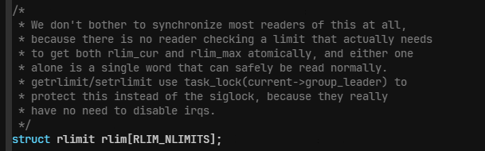
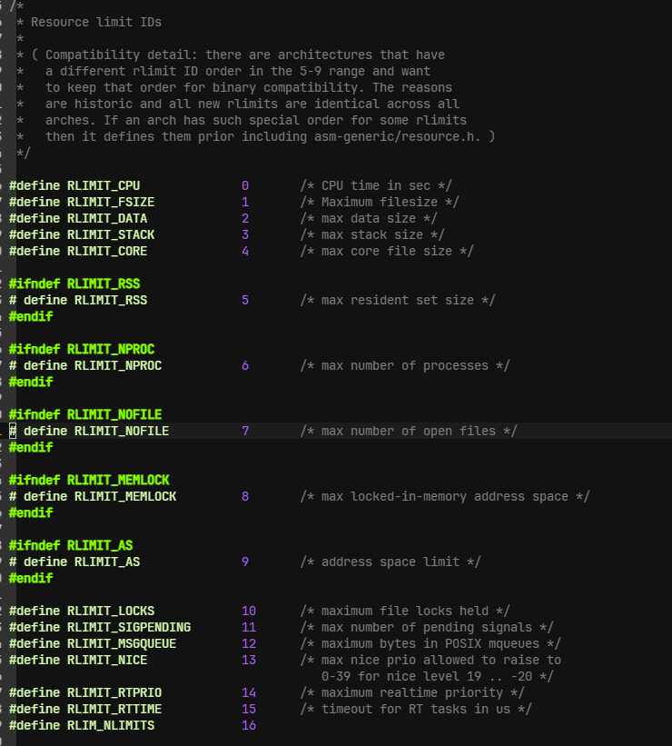
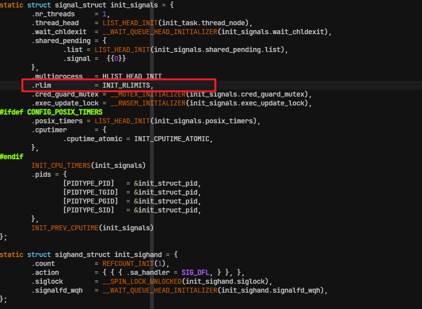
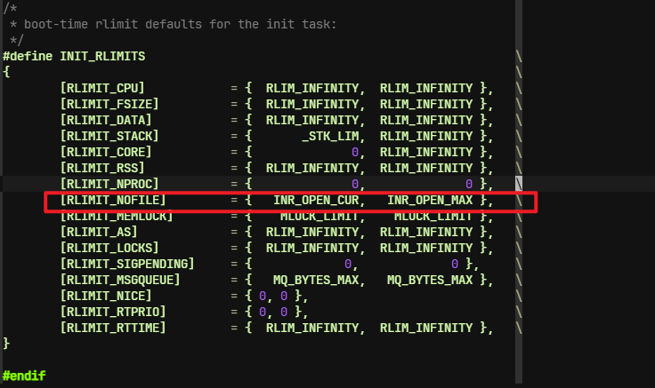
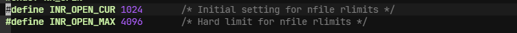

## Table of contents

在turbostat.c文件中，调用了这样一段函数，增加了文件进程文件描述符大小

```cpp
void set_rlimit(void)
{
        struct rlimit limit;

        if (getrlimit(RLIMIT_NOFILE, &limit) < 0)
                err(1, "Failed to get rlimit");

        if (limit.rlim_max < MAX_NOFILE)
                limit.rlim_max = MAX_NOFILE;
        if (limit.rlim_cur < MAX_NOFILE)
                limit.rlim_cur = MAX_NOFILE;

        if (setrlimit(RLIMIT_NOFILE, &limit) < 0)
                err(1, "Failed to set rlimit");
}

```

查看setrlimit函数的实现

```cpp
static __attribute__((unused))
int setrlimit(int resource, const struct rlimit *rlim)
{
        struct rlimit64 rlim64 = {
                .rlim_cur = rlim->rlim_cur,
                .rlim_max = rlim->rlim_max,
        };

        return __sysret(sys_prlimit64(0, resource, &rlim64, NULL));
}

static __attribute__((unused))
int sys_prlimit64(pid_t pid, int resource,
                  const struct rlimit64 *new_limit, struct rlimit64 *old_limit)
{
        return my_syscall4(__NR_prlimit64, pid, resource, new_limit, old_limit);
}

SYSCALL_DEFINE4(prlimit64, pid_t, pid, unsigned int, resource,
                const struct rlimit64 __user *, new_rlim,
                struct rlimit64 __user *, old_rlim)
{
        struct rlimit64 old64, new64;
        struct rlimit old, new;
        struct task_struct *tsk;
        unsigned int checkflags = 0;
        int ret;

        if (old_rlim)
                checkflags |= LSM_PRLIMIT_READ;

        if (new_rlim) {
                if (copy_from_user(&new64, new_rlim, sizeof(new64)))
                        return -EFAULT;
                rlim64_to_rlim(&new64, &new);
                checkflags |= LSM_PRLIMIT_WRITE;
        }

        rcu_read_lock();
        tsk = pid ? find_task_by_vpid(pid) : current;
        if (!tsk) {
                rcu_read_unlock();
                return -ESRCH;
        }
        ret = check_prlimit_permission(tsk, checkflags);
        if (ret) {
                rcu_read_unlock();
                return ret;
        }
        get_task_struct(tsk);
        rcu_read_unlock();

        ret = do_prlimit(tsk, resource, new_rlim ? &new : NULL,
                        old_rlim ? &old : NULL);

        if (!ret && old_rlim) {
                rlim_to_rlim64(&old, &old64);
                if (copy_to_user(old_rlim, &old64, sizeof(old64)))
                        ret = -EFAULT;
        }

        put_task_struct(tsk);
        return ret;
}


```

然后调用do_prlimit

```cpp
/* make sure you are allowed to change @tsk limits before calling this */
static int do_prlimit(struct task_struct *tsk, unsigned int resource,
                      struct rlimit *new_rlim, struct rlimit *old_rlim)
{
        struct rlimit *rlim;
        int retval = 0;

        if (resource >= RLIM_NLIMITS)
                return -EINVAL;
        resource = array_index_nospec(resource, RLIM_NLIMITS);

        if (new_rlim) {
                if (new_rlim->rlim_cur > new_rlim->rlim_max)
                        return -EINVAL;
                if (resource == RLIMIT_NOFILE &&
                                new_rlim->rlim_max > sysctl_nr_open)
                        return -EPERM;
        }

        /* Holding a refcount on tsk protects tsk->signal from disappearing. */
        rlim = tsk->signal->rlim + resource;
        task_lock(tsk->group_leader);
        if (new_rlim) {
                /*
                 * Keep the capable check against init_user_ns until cgroups can
                 * contain all limits.
                 */
                if (new_rlim->rlim_max > rlim->rlim_max &&
                                !capable(CAP_SYS_RESOURCE))
                        retval = -EPERM;
                if (!retval)
                        retval = security_task_setrlimit(tsk, resource, new_rlim);
        }
        if (!retval) {
                if (old_rlim)
                        *old_rlim = *rlim;
                if (new_rlim)
                        *rlim = *new_rlim;
        }
        task_unlock(tsk->group_leader);

        /*
         * RLIMIT_CPU handling. Arm the posix CPU timer if the limit is not
         * infinite. In case of RLIM_INFINITY the posix CPU timer code
         * ignores the rlimit.
         */
        if (!retval && new_rlim && resource == RLIMIT_CPU &&
            new_rlim->rlim_cur != RLIM_INFINITY &&
            IS_ENABLED(CONFIG_POSIX_TIMERS)) {
                /*
                 * update_rlimit_cpu can fail if the task is exiting, but there
                 * may be other tasks in the thread group that are not exiting,
                 * and they need their cpu timers adjusted.
                 *
                 * The group_leader is the last task to be released, so if we
                 * cannot update_rlimit_cpu on it, then the entire process is
                 * exiting and we do not need to update at all.
                 */
                update_rlimit_cpu(tsk->group_leader, new_rlim->rlim_cur);
        }

        return retval;
}


```

- 进行resource验证合法性
- 验证新资源软限制(rlim_cur)不大于硬限制(rlim_amx)，否则返回EINVAL
- 判断是文件描述服限制（RLIMIT_NOFILE） 并且新的硬限制（r_lim_max）是否大于系统允许的最大值
- 前面所有条件都满足，将new_rlim赋值给 rlim（即将新的资源值写入到目标进程的资源限制结构体）
- rlim = tsk->signal->rlim + resource;
  - 通过 resource作为索引，内核可以快速定位到对应的 rlim 结构体

task_struct有一个定义了signal_struct数据结构里的rlimit数组



Linux 系统支持多种资源限制，每种资源都有对应的标识符，如 RLIMIT_CPU（CPU 时间限制）、RLIMIT_AS（地址空间限制）、RLIMIT_NOFILE（打开文件描述符数量限制）等。这些标识符通常被定义为连续的整数常量（枚举值），使得它们可以直接用作数组的索引。




进程第一次初始化rimit时候，实在 init_signals中进行的









# end
