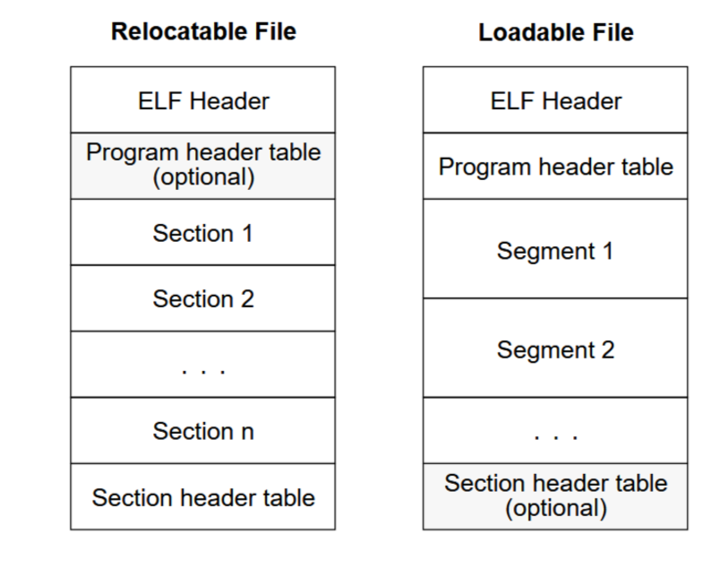
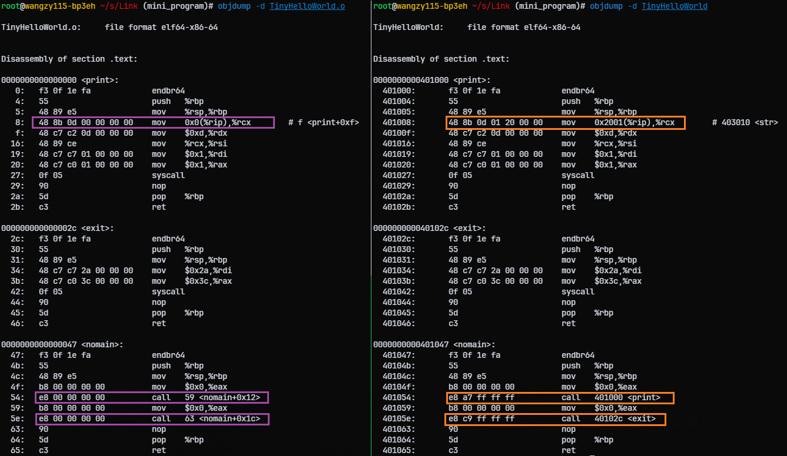

## 编译和链接

通过我们直接使用gcc编译运行源文件时，实际分为四个过程，整体过程如下所示

* 预处理（Prepressing)
* 编译（Compilation)
* 汇编(Assembly)
* 链接(Linking)


---

### 预编译

gcc 加上-E参数只进行预编译，或者使用cpp命令,生成.i文件

```bash
gcc -E hello.c -o hello.i
cpp hello.c > hello.i
```

* 展开所有的宏定义
* 处理条件预编译指令
* 删除注释、添加调试的行号、
* 保留#pramgma编译器指令

### 编译

词法分析、语法分析、语义分析，优化生产相应的汇编代码文件。

```bash
gcc -S hello.i -o hello.s
cc1 hello.c
```

gcc实际上是后台程序封装，根据不同参数要求去调用：cc1、as、ld

由于早期直接使用机器语言和汇编语言编写指令十分费事，而且总是依赖于特定的机器，无法令人接受，所以人们期望采用自然语言的形式来描述程序，后来诞生出了各种编程语言

编译过程可以分为六步：

- 词法分析
- 语法分析
- 语义分析
- 中间语言生成
- 目标代码优化

#### 词法分析

将源代码输入到扫描器，进行词法分析，将源代码的字符序列分割成一系列的记号，

词法分析产生的记号一般可以分为如下几类：关键字、标识符、字面量（包括数字、字符串等）和特殊符号（如加号、等号）。在识别记号的同时，并将标识符存放到符号表，将数字、字符串常量存放到文字表

* `int` -> 关键字
* `a` -> 标识符
* `=` -> 运算符
* `5` -> 常量
* `;` -> 分号

#### 语法分析

语法分析器将对由扫描器产生的记号进行语法分析，生成语法树表达式，检查语法的正确性（比如表达式不正确、括号不匹配、缺少操作符等）

```cpp
int a = b + c;
    =
   / \
  a   +
     / \
    b   c

```

#### 语义分析

语法分析是在语句上检查是否有意义

编译期分析的语意是**静态语意**，检查不同类型之间进行运算、不同类型数值之前的转换是否合法

运行期间进行分析的语意是**动态语义**，比如除零不合法

语义分析器还对符号表里的符号类型也做了更新。

#### 中间语言的生成

将语法树转化为与硬件无关的中间语言

中间代码通常采用三地址码、P代码形式

比如a = b + c * d; 生成的三地址码如下

```cpp
t1 = c * d
t2 = b + t1
a = t2
```

编译期前端将产生机器无关的中间代码，编译器后端针对不同的机器平台生成目标机器代码

#### 目标代码生成与优化

编译器后端包括**代码生成器**和**目标代码优化器**

代码生成器将中间代码转换成目标机器代码

目标代码优化器对目标代码进行优化，用位移代替乘法：1<<32 等等价于 2^32，删除多余的指令等

### 汇编

通过汇编器将汇编代码转换成机器指令，生成目标文件（Object File）

~~~bash
as hello.s -o hello.o
gcc -c hello.s -o hello.o
~~~

通过汇编器将汇编代码转换成机器指令，生成目标文件（Object File）

在这个过程中会生重定位表、符号表，便于后续链接过程

### 链接

分为动态链接和静态链接

分为动态链接和静态链接

* 链接的过程包括地址和空间分配（Address and Storage Allocation）、符号决议（Symbol Resolution）和重定位（Relocation）这几步
* 使用链接器时，会根据所引用其他模块的函数和全局变量无需知道它们的地址，链接器在链接时会根据引用的符号自动去相应的模块查找真正的地址。

创建a.c和b.c，分别进行`gcc -c`生成`a.o`和`b.o`文件，

```c
// a.c
#include <stdio.h>

int main () {
        int a = 2, b = 3;
        int c = sum (a, b);
        printf("%d\n", c);
        return 0;
}
```

```c
// b.c
int sum (int l, int r) {
        return l + r;
}
```

```bash
gcc -c a.c -o a.o -g
gcc -c b.c -o b.o -g
objdump -dSCl a.o
gcc a.o b.o -o ab
objdump -dSCl ab
```

反编译`a.o`和`ab.o`进行对比


在单独编译时，无法知道sum函数的地址，所以将目标地址设置成0，当链接器链接时进行了**目标地址的修正**， 这个地址修正的过程叫做**重定位**（Relocation），每个要被修正的地方叫一个**重定位入口**（Relocation Entry）。

## 目标文件

目标文件的结构因平台和格式而异，但通常遵循某种文件格式，如 ELF（Executable and Linkable Format）在 Linux 中广泛使用。

目前可执行文件格式Windows下的PE（Portable Executable Linkable Format）和Linux下的ELF（Executable Linkable Format）都是COFF（Common file format）格式的变种。目标文件就是源代码编译但未进行链接的哪些中间文件（.obj或.o文件）。
动态链接库（.dll、.so）、静态链接库（.lib、.a）文件也都按照可执行文件格式存储
ELF标准中把系统中采用的ELF文件格式归为以下4类


| ELF文件类型      | 说明                                                                                                                                              | 实例                             |
| ------------------ | --------------------------------------------------------------------------------------------------------------------------------------------------- | ---------------------------------- |
| 可重定位目标文件 | 包含了代码和数据、进行链接后会生成可执行文件、共享目标文件                                                                                        | Linux下.o、Windows下的.obj       |
| 可执行文件       | 可以直接执行的程序                                                                                                                                | /bin/bash下的文件、Windows的.exe |
| 共享目标文件     | 包含代码和数据，1.链接器使用这种文件跟其他可重定位文件和目标文件进行链接 2.动态连接器将这几种共享目标文件和可执行文件结合、进程映像的一部分来运行 | Linux下的.so Windows下的DLL      |
| 核心转储·文件   | 当进程意外终止时，系统可以将改进程的地址空间的内容及终止时的一些其他信息转储到核心转储文件                                                        | Linux下的 core dump              |

```bash
root@wangzy115-bp3eh ~/s/Link (link_example_1)# file a.o
a.o: ELF 64-bit LSB relocatable, x86-64, version 1 (SYSV), with debug_info, not stripped

root@wangzy115-bp3eh ~/s/Link (link_example_1)# file ab
ab: ELF 64-bit LSB pie executable, x86-64, version 1 (SYSV), dynamically linked, interpreter /lib64/ld-linux-x86-64.so.2, with debug_info, not stripped

```

通过`file`命令查看对应的文件格式，通过`readelf`命令查看程序头

```bash
root@wangzy115-bp3eh ~/s/Link (link_example_1)# readelf -h ab
ELF Header:
  Magic:   7f 45 4c 46 02 01 01 00 00 00 00 00 00 00 00 00
  Class:                             ELF64
  Data:                              2's complement, little endian
  Version:                           1 (current)
  OS/ABI:                            UNIX - System V
  ABI Version:                       0
  Type:                              DYN (Position-Independent Executable file)
  Machine:                           Advanced Micro Devices X86-64
  Version:                           0x1
  Entry point address:               0x1060
  Start of program headers:          64 (bytes into file)
  Start of section headers:          15176 (bytes into file)
  Flags:                             0x0
  Size of this header:               64 (bytes)
  Size of program headers:           56 (bytes)
  Number of program headers:         12
  Size of section headers:           64 (bytes)
  Number of section headers:         34
  Section header string table index: 33


```

### 目标文件的格式

ELF文件格式分为：

- ELF文件头 (ELF Header)
- 程序头表（Program header table）
- 段表/节头部表（Section Header Table）
- 重定位表（Relcation Table）
- 字符串表
- 符号表
- 各个段



### ELF文件头 (ELF Header)

包含整个文件的基本属性，文件头中定义了ELF魔数、文件机器字节长度、数据存储方式、版本、运行平台、ABI版本、ELF重定位类型、硬件平台、硬件平台版本、入口地址、程序头入口和长度、段表的位置及段的数量。


ELF魔数：最前面的 Magic 的十六个字节表示

- 第0个字节对应ASCII字符里面的DEL控制符，第1~3个字节刚好是ELF三个字母的ASCII值，几乎所有的可执行文件开始的几个字节都是这个魔数，这种魔数用于确认文件的类型
- 第4个字节标识文件的位数，0x01表示32位，0x02表示64位
- 第5个字节表示文件的字典序，0x01表示小端序、0x02表示大端序
- 第6个字节表示ELF文件的主版本号，一般是1
- 后面的9个字节ELF标准没有定义，作为扩展使用

### 节头部表（Section Header Table）

节头部表描述了ELF各个段的信息，比如每个段的段名、段的长度、在文件中的偏移、读写权限及段的其他属性。

ELF的段结构就是由段表决定的。通过 `readelf -S` 命令可以进行查看


* **Name** - **节区名称（Section Name）**
  * 显示节区的名称。例如`.text`、`.data`、`.bss` 等。若没有名称，可能显示为`NULL` 或空字符串。
* **Type** - **节区类型（Section Type）**
  * 显示节区的类型，决定该节区的用途。例如：
    * `PROGBITS`：包含程序数据或代码。
    * `STRTAB`：字符串表，存储字符串。
    * `DYNSYM`：动态符号表，包含动态链接时使用的符号。
    * `RELA`：重定位表，包含程序的重定位信息。
    * `GNU_HASH`：GNU 格式的符号哈希表等。
* **Address** - **节区加载地址（Section Address）**
  * 显示该节区在内存中的加载地址。该地址指示节区在程序运行时加载到内存中的位置。若节区不需要加载到内存（如`.bss`），此字段可能为`0` 或`0x0`。
* **Off** - **节区偏移（Section Offset）**
  * 表示节区在文件中的偏移量，也就是该节区从文件开头开始的字节位置。它决定了节区在 ELF 文件中的起始位置。
* **Size** - **节区大小（Section Size）**
  * 显示节区的字节大小，表示该节区在文件或内存中的占用空间大小。如果节区没有实际数据（例如`.bss`），它可能为 0 或一个虚拟大小。
* **ES** - **节区条目大小（Entry Size）**
  * 对于某些类型的节区（如符号表、重定位表等），显示节区条目的大小。即每个元素所占用的字节数。
    * 例如，符号表`.dynsym` 的条目大小是 18 字节。
* **Flg** - **节区标志（Flags）**
  * 显示节区的标志，描述节区的特性，使用字符表示：
    * `A`：节区可分配（Allocated），表示它会被加载到内存。
    * `X`：节区可执行（Executable），表示它包含可执行代码。
    * `W`：节区可写（Writable），表示它可以被修改。
    * `I`：信息（Info），通常表示该节区包含信息，比如重定位信息。
    * `L`：包含本地符号（Local），该节区只包含局部符号。
    * `M`：合并（Merge），表示节区支持合并。
    * `S`：支持分段（String），通常用于字符串表。
* **Lk** - **节区链接（Section Link）**
  * 表示节区之间的链接。通常指向与该节区相关的节区或段。比如对于符号表，它会链接到字符串表。
* **Inf** - **节区信息（Section Info）**
  * 对于某些类型的节区，表示附加的节区信息。例如，对于符号表，它可能是符号的数量；对于重定位表，它可能是重定位条目的数量。
* **Al** - **节区对齐（Section Alignment）**
  * 表示节区在内存中的对齐要求。节区的起始位置必须满足特定的对齐约束。
  * 例如，`Al` 的值可能为 4，表示节区必须在 4 字节对齐的位置开始；如果为 16，则意味着节区必须在 16 字节对齐的位置开始。

### 程序头表（Program header table）

描述ELF的Segment，用于加载程序时的内存映射

通过`readelf -l`命令查看可执行文件中的段

`LOAD`类型的segment需要被映射，根据Flg不同的标志位映射到不同的`VMA`，只有可执行文件和共享库文件才需要有程序头表，目标文件是没有的，面向运行时内存映射

`readelf -l ab -W`


`LOAD`类型的segment需要被映射

根据Flg不同的标志位映射到不同的`VMA`

只有可执行文件和共享库文件才需要有程序头表，目标文件是没有的

### 重定位表

链接器怎么知道哪些指令是需要被调整的呢？

* 在ELF文件中有重定位表用来描述如何修改相应段里的内容
* 通过 `objdump -r` 或 `readelf -r` 命令可以查看对应的目标文件需要重定位的地方

链接器在处理目标文件时，需要对目标文件一些部位进行重定位，修正地址引用的位置，对于每个需要重定位的代码段或数据段，都需要一个相应的重定位表。比如`.rel.text`就是`.text`的重定位表


* Offset: 表示需要纠正的符号引用的起始位置在目标段的偏移
* Info: 包含符号索引和类型信息。
  * 前 8 位表示符号索引，指向目标文件符号表 (.symtab)
  * 后 8 位表示重定位类型（如 0002 表示 R_X86_64_PC32，0004 表示 R_X86_64_PLT32）。
* Type: 重定位类型，表示如何修正地址。
  * `R_X86_64_PC32`：相对地址重定位。
  * `R_X86_64_32`：绝对地址重定位。
  * `R_X86_64_JUMP_SLOT`：函数调用入口的重定位。
* Sym.Value: 符号的当前值（在未链接时为 0）。
* Sym.Name + Addend: 符号名称偏移量



